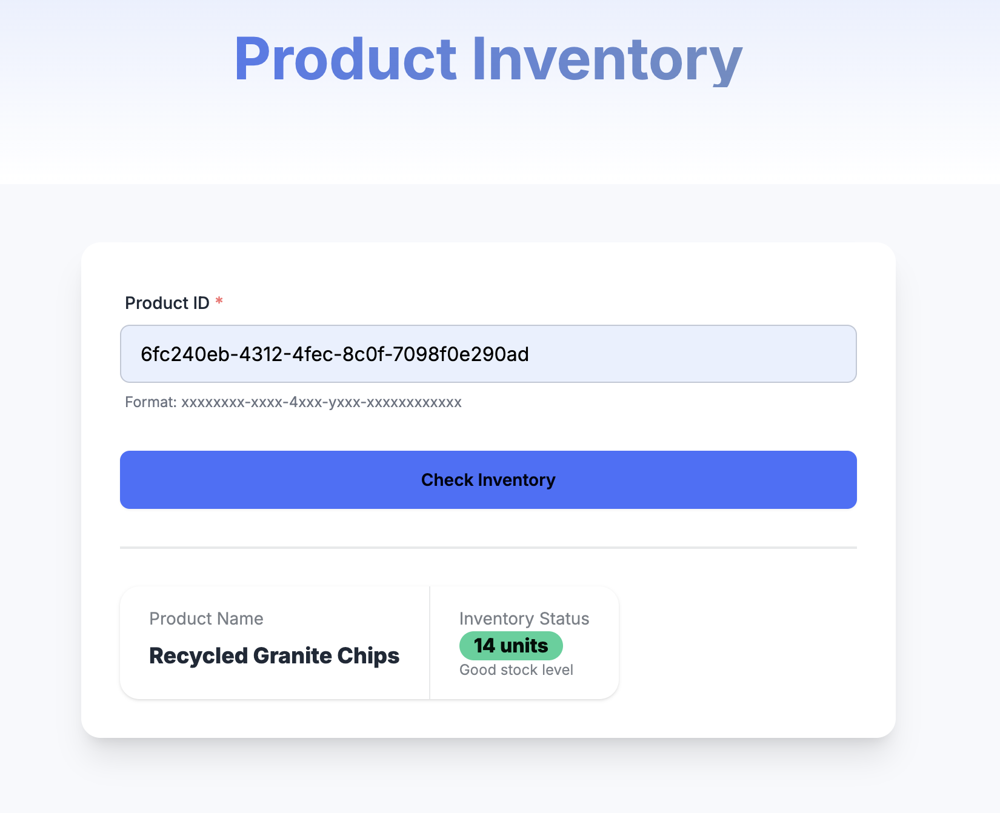
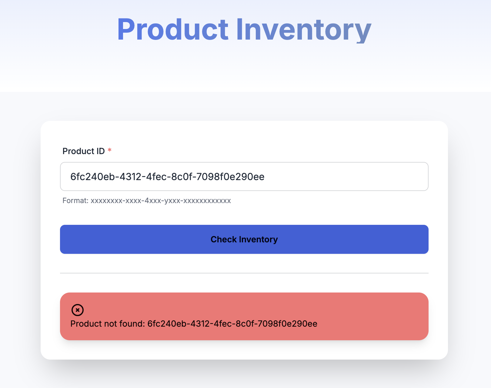
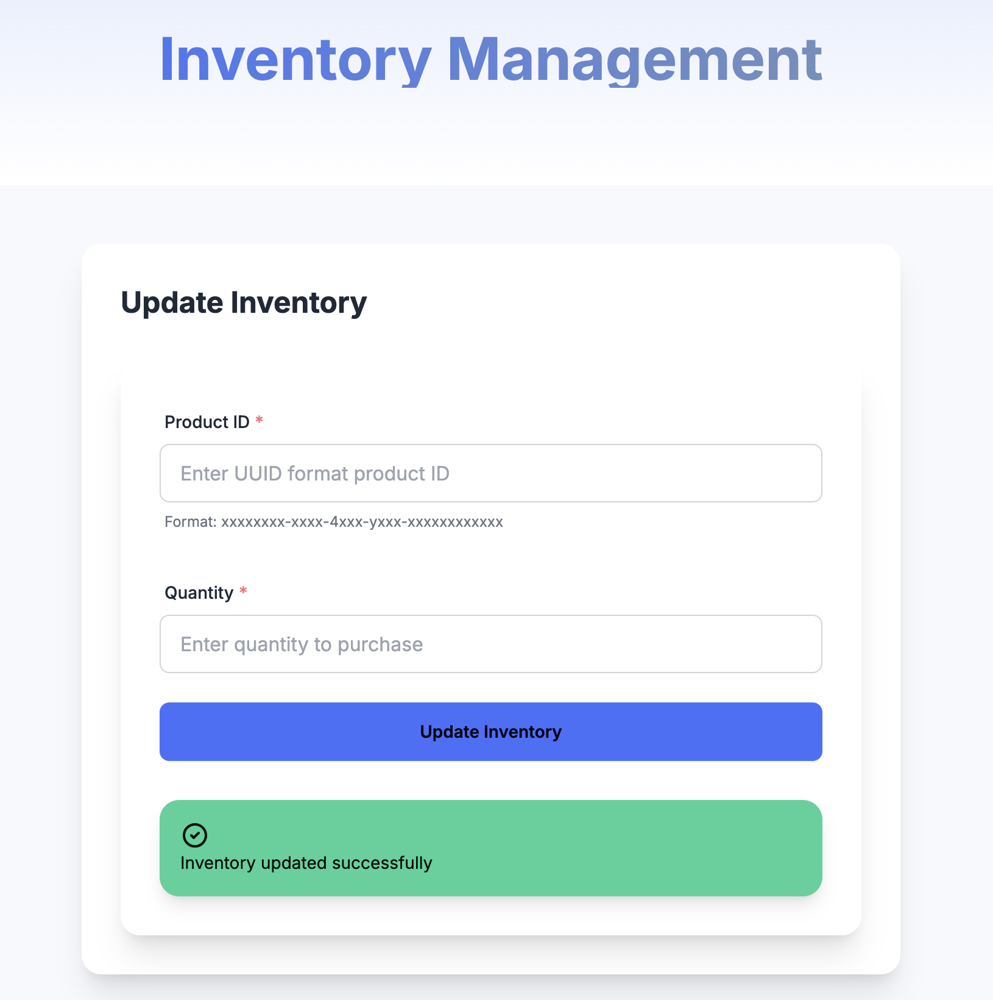
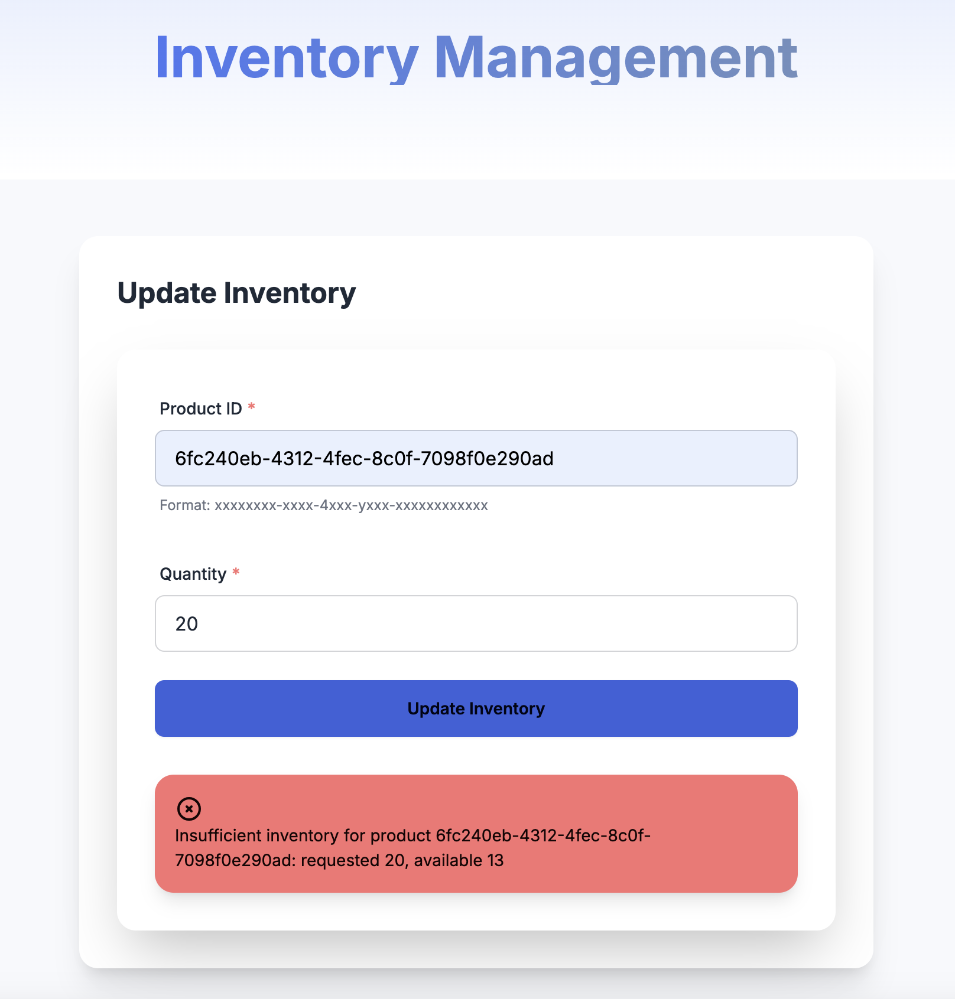

# Overview

an e-commerce inventory management system using a monorepo architecture (I've created it with this command pnpm dlx create-turbo@latest --example with-tailwind ecommerce-monorepo-challenge). It consists of three main applications:

- **Store Dashboard (Next.js)** – Manage products and inventory
- **Store (Next.js)** – Front-facing shopping experience
- **Inventory Microservice (Express + Drizzle + PostgreSQL)** – Manages product inventory

### Store

<div align="center">
  
</div>

<div align="center">
  
</div>

### Dashboard

<div align="center">
  
</div>

<div align="center">
  
</div>

## 1. Prerequisites

- Node.js >= 18
- PostgreSQL >= 13
- PNPM >= 8.15.6

## 2. Technical Stack

- **Backend Service**: Express.js with TypeScript
- **Frontend Applications**: Next.js 14
- **Database**: PostgreSQL with Drizzle ORM
- **Package Management**: PNPM with Workspaces
- **Build System**: Turborepo
- **Testing**: Jest with Supertest
- **Styling**: Tailwind CSS

## 3. Project Structure

```
apps/
  dashboard/      # Next.js for admin
  store/          # Next.js for public
  inventory/      # Express-based microservice
    src/
      config/           # DB & environment setup
      controllers/      # Express controllers
      middlewares/      # Error & validation middlewares
      models/           # Type definitions & schema
      repositories/     # Database-access layer with Drizzle
      routes/           # Express router definitions
      services/         # Business logic
      utils/            # Custom errors, seeding utilities
      app.ts            # App configuration (Express, CORS, etc.)
      index.ts          # Entry point (app.listen)
    tests/              # Unit & integration tests
packages/
  api-client/           # Shared client for inventory endpoints
  confug-eslint/        # Shared eslint config
  confug-tailwind/      # Shared tailwind config
  confug-typescript/    # Shared typescript config
  confug-ui/            # Shared UI
  ...
```

- **Dashboard & Store** each have minimal Next.js code referencing @repo/api-client.
- **The Inventory** folder follows a layered approach for maintainability.

## 4. API Documentation

1. Get Product Inventory: `GET /inventory/:productId`

- Successful Response:

```
{
  "id": "uuid",
  "name": "Product Name",
  "inventoryCount": 100
}
```

- Error Responses:

```
{
  "error": error_message,
  "status": error_code
}
```

2. Update Inventory: `POST /inventory/:productId/purchase`

- Request body:

```
{
  "quantity": 5
}
```

- Successful Response:

```
{
  "message": "Inventory updated successfully"
}
```

- Error Responses:

```
{
  "error": error_message,
  "status": error_code
}
```

## 5. Architecture & Design Patterns

### 5.1 Monorepo Structure

- Unified development experience with shared configurations
- Efficient build caching and dependency management
- Consistent tooling across all applications
- Shared UI components and business logic

### 5.2 Backend Architecture

- Layered architecture pattern:
  - Controllers: Request/response handling
  - Services: Business logic
  - Repositories: Data access
  - Models: Data structures and validation
- Clean separation of concerns for maintainability
- Repository pattern for database abstraction
- Dependency injection for loose coupling
- Service Objects

### 5.3 Frontend Architecture

- Next.js for both admin and store applications
- Shared UI components library
- API client package for type-safe backend communication
- Component-based architecture with Tailwind CSS

## 6. Best Practices

### 6.1 Code Quality

- Consistent code style with shared ESLint config
- Type safety with TypeScript
- Unit and integration testing with Jest
- Automated formatting with Prettier
- Component-driven UI development

### 6.2 API Design

- RESTful principles
- Clear error handling
- Type-safe API contracts
- Proper HTTP status codes

### 6.3 Security Considerations

- CORS configuration for API security
- Input validation and sanitization
- Environment variable management

### 6.4 Database Design

- PostgreSQL for ACID compliance
- Drizzle ORM for type-safe queries
- Migration management
- Seeding utilities for development

## 7. Getting Started

### 7.1 Local Development Setup

1. Clone the repository
2. Install dependencies: `pnpm install`
3. Setup environment variables:

- Copy `.env.example` to `.env` in inventory service
- Configure database connection, and create a database for inventory

4. Initialize database:

```bash
cd apps/inventory
pnpm db:migrate
pnpm db:seed
```

5. Start development servers:

```bash
turbo dev
```

### 7.2 Testing

#### Automated Testing

```bash
# Inventory service tests
cd apps/inventory
pnpm test

# API client tests
cd packages/api-client
pnpm test
```

#### Manual Testing

```bash
# Get product inventory
curl http://localhost:4000/inventory/:productId

# Update inventory
curl -X POST http://localhost:4000/inventory/:productId/purchase \
  -H "Content-Type: application/json" \
  -d '{"quantity": 5}'
```

Testing Flow:

- Start the services
- Get a valid product ID from the seeded data (check database)
- Test GET endpoint to view inventory
- Test POST endpoint to update inventory
- Verify changes in the database
